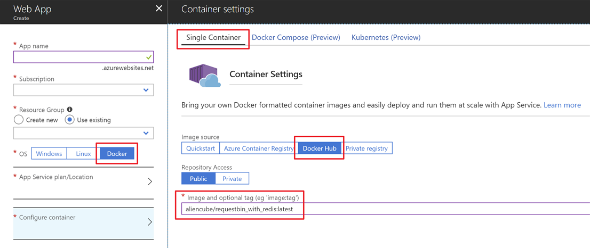
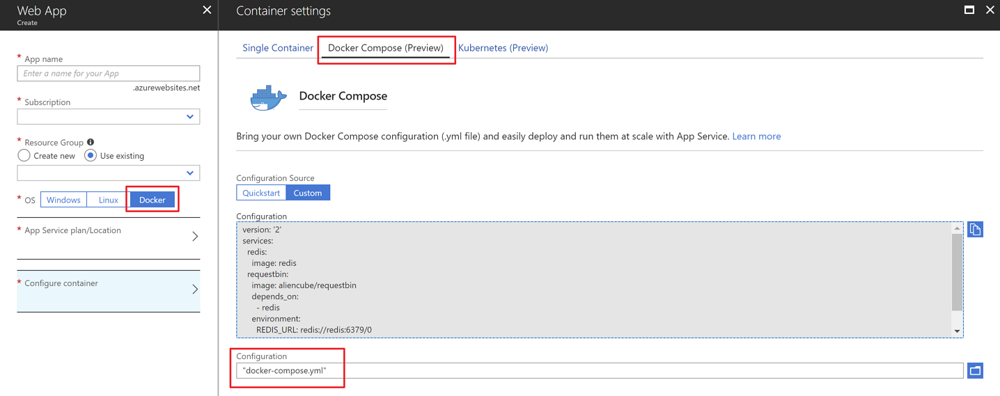
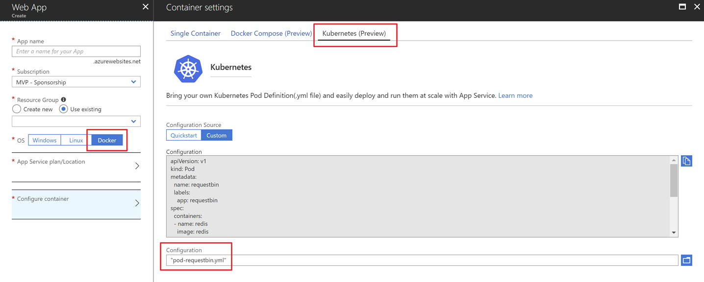

# RequestBin on Azure App Service #

This provides an ARM template and several container configurations to run RequestBin on Azure App Service.


## Prerequisites ##

* [Azure Subscription](https://azure.microsoft.com/en-au/free/)
* [Azure App Service on Linux](https://docs.microsoft.com/en-us/azure/app-service/containers/app-service-linux-intro)
* [Azure CLI 2.0](https://docs.microsoft.com/en-us/cli/azure/)


## Single Container ##

If you want to run the custom docker image on your local, simply build the `Dockerfile` and run it.

```docker
docker build . -t requestbin_app
docker -it -p 8000:80 requestbin_app
```

If you want to run this custom docker image on Azure App Service, you can achieve in three different ways:


### 1. ARM Template ###

Update `azuredeploy.parameters.json` with the given value:

```json
{
  ...
  "containerType": {
    "value": "DOCKER"
  },
  "containerConfig": {
    "value": "aliencube/requestbin_with_redis:latest"
  }
}
```

Then run the following Azure PowerShell command:

```
New-AzureRmResourceGroupDeployment `
    -Name [DEPLOYMENT_NAME] `
    -ResourceGroupName [RESOURCE_GROUP_NAME] `
    -TemplateFile azuredeploy.json `
    -TemplateParameterFile azuredeploy.parameters.json
    -Verbose
```

Alternatively, run the following Azure CLI command:

```
az group deployment create \
    -n [DEPLOYMENT_NAME] \
    -g [RESOURCE_GROUP_NAME] \
    --template-file azuredeploy.json \
    --parameters @azuredeploy.parameters.json \
    --verbose
```

> **NOTE**: Currently ARM template deployment is not supported.


### 2. Azure CLI ###

Enter the following Azure CLI command to create an Azure App Service instance.

```
az webapp create \
    -g [RESOURCE_GROUP_NAME] \
    -n [APP_SERVICE_NAME] \
    -p [APP_SERVICE_PLAN_NAME] \
    -i aliencube/requestbin_with_redis:latest
```


### 3. Azure Portal ###

When you create an Azure App Service instance, choose `Docker`, App Service Plan for Linux, and `Single Container`, then point the Docker image source to [`aliencube/requestbin_with_redis:latest`](https://hub.docker.com/r/aliencube/requestbin_with_redis/).




## Docker Compose ##

If you want to run the multiple containers on your local, simply run the docker compose command.

```docker
docker-compose up -d
```

If you want to run this docker compose on Azure App Serivce, you can achieve in three different ways:


### 1. ARM Template ###

Convert `docker-compose.yml` into a base-64 string.

```poweshell
$content = Get-Content docker-compose.yml -Encoding UTF8 -Raw
$bytes = [System.Text.Encoding]::UTF8.GetBytes($content)
$config = [Convert]::ToBase64String($bytes)
```

Then update `azuredeploy.parameters.json` with the given value:

```json
{
  ...
  "containerType": {
    "value": "COMPOSE"
  },
  "containerConfig": {
    "value": "[BASE64_ENCODED_docker-compose.yml]"
  }
}
```

Then run the following Azure PowerShell command:

```
New-AzureRmResourceGroupDeployment `
    -Name [DEPLOYMENT_NAME] `
    -ResourceGroupName [RESOURCE_GROUP_NAME] `
    -TemplateFile azuredeploy.json `
    -TemplateParameterFile azuredeploy.parameters.json
    -Verbose
```

Alternatively, run the following Azure CLI command:

```
az group deployment create \
    -n [DEPLOYMENT_NAME] \
    -g [RESOURCE_GROUP_NAME] \
    --template-file azuredeploy.json \
    --parameters @azuredeploy.parameters.json \
    --verbose
```

> **NOTE**: Currently ARM template deployment is not supported.


### 2. Azure CLI ###

Enter the following Azure CLI command to create an Azure App Service instance.

```
az webapp create \
    -g [RESOURCE_GROUP_NAME] \
    -n [APP_SERVICE_NAME] \
    -p [APP_SERVICE_PLAN_NAME] \
    --multicontainer-config-type COMPOSE \
    --multicontainer-config-file https://raw.githubusercontent.com/aliencube/RequestBin-on-Azure-App-Service/master/docker-compose.yml
```


### 3. Azure Portal ###

When you create an Azure App Service instance, choose `Docker`, App Service Plan for Linux, and `Docker Compose`, then select `docker-compose.yml`.




## Kubernetes ##

If you want to run the multiple containers on your local using Kubernetes pod, simply run the following command.

```
kubectl create -f pod-requestbin.yml
kubectl expose pod requestbin \
        --port 8000 --target-port 80 \
        --name requestbin --type NodePort
kubectl describe service requestbin
```

If you want to run this Kubernetes pod on Azure App Serivce, you can achieve in three different ways:


### 1. ARM Template ###

Convert `pod-requestbin.yml` into a base-64 string.


```poweshell
$content = Get-Content pod-requestbin.yml -Encoding UTF8 -Raw
$bytes = [System.Text.Encoding]::UTF8.GetBytes($content)
$config = [Convert]::ToBase64String($bytes)
```

Then update `azuredeploy.parameters.json` with the given value:

```json
{
  ...
  "containerType": {
    "value": "KUBE"
  },
  "containerConfig": {
    "value": "[BASE64_ENCODED_pod-requestbin.yml]"
  }
}
```

Then run the following Azure PowerShell command:

```
New-AzureRmResourceGroupDeployment `
    -Name [DEPLOYMENT_NAME] `
    -ResourceGroupName [RESOURCE_GROUP_NAME] `
    -TemplateFile azuredeploy.json `
    -TemplateParameterFile azuredeploy.parameters.json
    -Verbose
```

Alternatively, run the following Azure CLI command:

```
az group deployment create \
    -n [DEPLOYMENT_NAME] \
    -g [RESOURCE_GROUP_NAME] \
    --template-file azuredeploy.json \
    --parameters @azuredeploy.parameters.json \
    --verbose
```

> **NOTE**: Currently ARM template deployment is not supported.


### 2. Azure CLI ###

Enter the following Azure CLI command to create an Azure App Service instance.

```
az webapp create \
    -g [RESOURCE_GROUP_NAME] \
    -n [APP_SERVICE_NAME] \
    -p [APP_SERVICE_PLAN_NAME] \
    --multicontainer-config-type KUBE \
    --multicontainer-config-file https://raw.githubusercontent.com/aliencube/RequestBin-on-Azure-App-Service/master/pod-requestbin.yml
```


### 3. Azure Portal ###

When you create an Azure App Service instance, choose `Docker`, App Service Plan for Linux, and `Kubernetes`, then select `pod-requestbin.yml`.




## Contribution ##

Your contributions are always welcome! All your work should be done in your forked repository. Once you finish your work with corresponding tests, please send us a pull request onto our `master` branch for review.


## License ##

**RequestBin on Azure App Service** is released under [MIT License](http://opensource.org/licenses/MIT)

> The MIT License (MIT)
>
> Copyright (c) 2018 [aliencube.org](https://aliencube.org)
> 
> Permission is hereby granted, free of charge, to any person obtaining a copy of this software and associated documentation files (the "Software"), to deal in the Software without restriction, including without limitation the rights to use, copy, modify, merge, publish, distribute, sublicense, and/or sell copies of the Software, and to permit persons to whom the Software is furnished to do so, subject to the following conditions:
> 
> The above copyright notice and this permission notice shall be included in all copies or substantial portions of the Software.
> 
> THE SOFTWARE IS PROVIDED "AS IS", WITHOUT WARRANTY OF ANY KIND, EXPRESS OR IMPLIED, INCLUDING BUT NOT LIMITED TO THE WARRANTIES OF MERCHANTABILITY, FITNESS FOR A PARTICULAR PURPOSE AND NONINFRINGEMENT. IN NO EVENT SHALL THE AUTHORS OR COPYRIGHT HOLDERS BE LIABLE FOR ANY CLAIM, DAMAGES OR OTHER LIABILITY, WHETHER IN AN ACTION OF CONTRACT, TORT OR OTHERWISE, ARISING FROM, OUT OF OR IN CONNECTION WITH THE SOFTWARE OR THE USE OR OTHER DEALINGS IN THE SOFTWARE.
